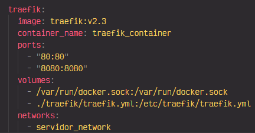
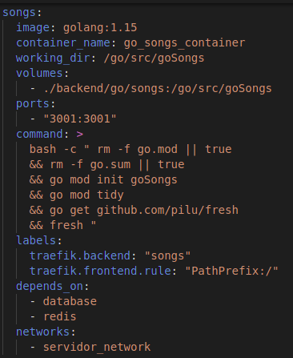

# Play It

## Práctica Proyecto Servidor

### ¿Qué es Golang?

Go es un lenguaje de programación concurrente y compilado, desarrollado por los ingenieros de Google. Vio la luz en el año 2009, esto hace a Go un lenguaje relativamente nuevo, pero que esto no nos engañe, Go es un lenguaje maduro, con el cual se han desarrollado miles de proyectos alrededor del mundo.

Go es un lenguaje tipado estático, una vez declaremos el tipo de dato de nuestra variable, la variable no podrá cambiar de tipo en todo el programa, eso sí, en Go no es necesario definir el tipo.

Go esta pensado para ser implementado en tareas las cuales no tengan mucha interacción con los usuarios, es más un lenguaje de sistemas que de aplicaciones. Un área muy recurrente en donde podemos implementar Go es del lado servidor, ya sea que nuestro programa funciona como backend, como un microservicio o se encuentre realizando tareas un poco más complejas, tal vez, procesando datos.

#### Microservicios 

La arquitectura de microservicios es un patrón de diseño que estructura las aplicaciones como una colección de servicios. En un mundo impulsado por la computación en la nube, los microservicios se han convertido en uno de los patrones más populares de diseño de arquitectura. Las ventajas de utilizar microservicios son:

- Son fáciles de mantener y de poner a prueba.
- Poseen bajo acoplamiento.
- Se despliegan independientemente.
- Se organizan en base a las capacidades del negocio.
- Son propiedad de un grupo pequeño de personas.

### ¿Que és Laravel?

Laravel es uno de los frameworks de código abierto más fáciles de asimilar para PHP. Como framework resulta bastante moderno y ofrece muchas utilidades potentes a los desarrolladores, que permiten agilizar el desarrollo de las aplicaciones web.

Laravel pone énfasis en la calidad del código, la facilidad de mantenimiento y escalabilidad, lo que permite realizar proyectos desde pequeños a grandes o muy grandes. Además permite y facilita el trabajo en equipo y promueve las mejores prácticas.

Este trabaja con una arquitectura de carpetas avanzada, de modo que promueve la separación de los archivos con un orden correcto y definido, que guiará a todos los integrantes del equipo de trabajo y será un estándar a lo largo de los distintos proyectos. Por supuesto, dispone también de una arquitectura de clases también muy adecuada, que promueve la separación del código por responsabilidades. Su estilo arquitectónico es MVC.

### Traefik

Traefik es un equilibrador de carga y proxy inverso HTTP moderno que facilita la implementación de microservicios. 
Traefik se integra con los componentes de su infraestructura existente (Docker, Swarm mode, Kubernetes, Marathon, Consul, Etcd, Rancher, Amazon ECS, ...) y se configura automáticamente y dinámicamente. 
Traefik es un Edge Router de código abierto que hace que la publicación de sus servicios sea una experiencia divertida y fácil.
Recibe solicitudes en nombre de su sistema y descubre qué componentes son responsables de manejarlas.

Traefik es compatible de forma nativa con todas las principales tecnologías de clúster, como Kubernetes, Docker, Docker Swarm, AWS, Mesos, Marathon, etc. 
Puede manejar muchos al mismo tiempo.

Para poder utilizarlo tendremos que configurar varios archivos.

### Refactorización de GO

Lo primero que tuvimos que hacer fue modificar el archivo docker-compose.

Establecimos el direcotrio de trabajo a "/go/src/goApp"
Asignamos el volumen a "./backend/go:/go/src/goApp"

La nueva parte de Go quedaria de la siguiente forma:

Imagen Docker-compose

Una vez tengamos los cambios realizados, actualizaremos todos los imports en Go con la nueva ruta. 
Pasará de:

github.com/rmenendezdaw/Angular_Laravel_Go_APP/backend/go/users

A

goApp/users

### Creación de microservicios en GO

Para realizar la refactorización en GO para que pase a utilizar microservicios empezaremos creando la estructura de directorios.
Dentro de GO creamos el directorio songs, y dentro de este creamos los directorios:

| Directorio | Descripción |
| ------------- | ------------- |
| common | Aqui dentro se localizaran los ficheros compartidos asi como utilidades. |
| controllers | Incluirá los controladores necesarios para llevar a cabo las distintas acciones de los endpoints.| 
| data | Incluirá las funciones necesarias para obtener la información solicitada. |
| models | Incluirá los modelos utilizados por el microservicio. |
| routers | Aquí estarán la definición de rutas y endpoints. |

Una vez tengamos la arquitectura de directorios habrá que ir añadiendo los archivos y modificar los packages e imports.

#### Microservicio Songs

 La estructura de directorios tendrá la siguiente forma:

 **Imágen estructura*

 También tenemos que configurar el microservicio en el fichero docker-compose:

  **Imágen docker-songs*

Dónde:
 - Partiremos de una imágen de Go llamada "golang v1.15".
 - El nombre del contenedor será go_songs_container.
 - Su directorio de trabajo será /go/src/goSongs.
 - Utilizará el puerto 3001.
 - Dispondrá de los comandos para iniciar Go.
 - Dependerá de los servicios de MYSQL y de Redis.
 - Trabajará en la red común "servidor_network".

#### Microservicio users

 La estructura de directorios tendrá la siguiente forma:

 **Imágen estructura*

 También tenemos que configurar el microservicio en el fichero docker-compose:

  **Imágen docker-users*

Dónde:
 - Partiremos de la imágen de Go "golang v1.15".
 - El nombre del contenedor será go_users_container.
 - Su directorio de trabajo será /go/src/goUsers.
 - Utilizará el puerto 3000.
 - Dispondrá de los comandos para iniciar Go.
 - Dependerá de los servicios de MYSQL y de Redis.
 - Trabajará en la red común "servidor_network".

### Méctricas entre Traefik y Prometheus

Empezamos por el archivo "traefik.ylm" en el cual configuraremos los entrypoints:

Seguimos con el docker-compose:
Dónde:
- Partirá de una imágen de traefik

En los microservicios que queramos utilizar Traefik debemos utilizar labels:

